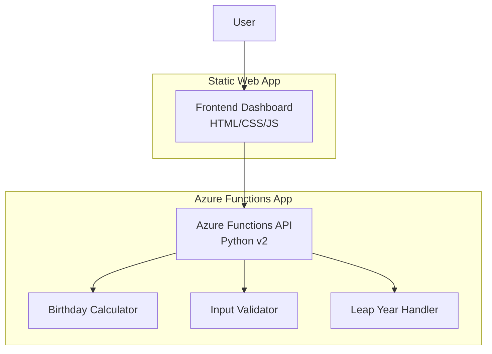

# Design Document: NextBirthdayCountdown

## Overview

NextBirthdayCountdown is a serverless birthday countdown application built using Azure Functions with Python v2 programming model for the backend API and a static HTML/CSS/JavaScript frontend. The system calculates when someone's next birthday will occur, handling edge cases like leap years, and provides both a REST API and a user-friendly web interface.

The architecture follows a simple client-server pattern where the frontend makes HTTP requests to the Azure Functions backend. The backend performs all birthday calculations using Python's standard library, while the frontend provides an intuitive interface for users to input their date of birth and view results.

## Architecture

The system consists of two main components:

1. **Backend API (Azure Functions)**: A single HTTP-triggered function that processes birthday calculations
2. **Frontend Dashboard**: A static web application that consumes the API



The frontend communicates with the backend through a single REST endpoint (`/api/nextbirthday`) using HTTP GET requests with query parameters. The backend validates inputs, performs calculations, and returns structured JSON responses.

## Components and Interfaces

### Backend Components

#### 1. HTTP Trigger Function
- **File**: `function_app.py`
- **Decorator**: `@app.route(route="nextbirthday", methods=["GET"])`
- **Purpose**: Main entry point for birthday calculation requests
- **Input**: HTTP request with `dob` query parameter
- **Output**: JSON response with birthday information or error details

#### 2. Input Validator
- **Purpose**: Validates date format and business rules
- **Validation Rules**:
  - DOB parameter presence
  - ISO YYYY-MM-DD format compliance
  - Date not in the future
- **Error Handling**: Returns HTTP 400 with descriptive messages

#### 3. Birthday Calculator
- **Purpose**: Core business logic for birthday calculations
- **Functions**:
  - Calculate current age in years
  - Determine next birthday date
  - Count days until next birthday
  - Format day of the week
  - Generate friendly messages

#### 4. Leap Year Handler
- **Purpose**: Manages February 29 birthday edge cases
- **Logic**: 
  - Check if next birthday year is leap year
  - Use February 28 for non-leap years
  - Use February 29 for leap years

### Frontend Components

#### 1. User Interface (index.html)
- Clean card-based layout
- Date input field for DOB
- Calculate button
- Output display areas for results
- Error message display area

#### 2. Styling (styles.css)
- Responsive design
- Clean, modern appearance
- Visual feedback for interactions
- Error state styling

#### 3. Application Logic (app.js)
- Form handling and validation
- API communication using fetch()
- Result display management
- Error handling and user feedback
- Configurable API base URL

## Data Models

### Request Model
```python
# Query Parameters
{
    "dob": "YYYY-MM-DD"  # ISO date format, required
}
```

### Success Response Model
```python
{
    "inputDob": str,              # Original input date
    "ageYears": int,              # Current age in complete years
    "nextBirthdayDate": str,      # Next birthday in YYYY-MM-DD format
    "nextBirthdayDayOfWeek": str, # Full day name (e.g., "Friday")
    "daysUntilNextBirthday": int, # Calendar days until next birthday
    "message": str                # Friendly message with emoji
}
```

### Error Response Model
```python
{
    "error": str,    # Human-readable error message
    "example": str   # Usage example showing correct format
}
```

### Internal Data Structures

#### Birthday Calculation Context
```python
@dataclass
class BirthdayContext:
    input_dob: date
    current_date: date
    birth_month: int
    birth_day: int
    current_year: int
    age_years: int
    next_birthday_date: date
    days_until: int
    day_of_week: str
```

## Correctness Properties

*A property is a characteristic or behavior that should hold true across all valid executions of a system-essentially, a formal statement about what the system should do. Properties serve as the bridge between human-readable specifications and machine-verifiable correctness guarantees.*

Now I need to analyze the acceptance criteria to determine which ones are testable as properties. Let me use the prework tool.

Based on the prework analysis, here are the key correctness properties derived from the requirements:

**Property 1: Valid input produces complete response**
*For any* valid date of birth in ISO YYYY-MM-DD format that is not in the future, the API should return HTTP 200 with a JSON response containing exactly the fields: inputDob, ageYears, nextBirthdayDate, nextBirthdayDayOfWeek, daysUntilNextBirthday, and message
**Validates: Requirements 1.4, 5.1**

**Property 2: Invalid input produces error response**
*For any* invalid date format or future date, the API should return HTTP 400 with a JSON response containing exactly the fields: error and example
**Validates: Requirements 2.2, 2.3, 6.1, 6.4**

**Property 3: Age calculation accuracy**
*For any* valid date of birth, the calculated age should equal the number of complete years between the birth date and the current date
**Validates: Requirements 3.1**

**Property 4: Next birthday calculation**
*For any* valid date of birth, the next birthday date should be the next occurrence of the birth month and day, and should always be in the future relative to the current date
**Validates: Requirements 3.2**

**Property 5: Days until birthday accuracy**
*For any* valid date of birth, the days until next birthday should equal the calendar days between the current date and the calculated next birthday date
**Validates: Requirements 3.3**

**Property 6: February 29 leap year handling**
*For any* date of birth on February 29, if the next birthday year is not a leap year, the next birthday date should be February 28 of that year; if it is a leap year, the next birthday date should be February 29
**Validates: Requirements 4.1, 4.2, 4.3**

**Property 7: Response format consistency**
*For any* valid input, the inputDob field should match the original input, the nextBirthdayDate should be in ISO YYYY-MM-DD format, and the nextBirthdayDayOfWeek should be a valid full day name
**Validates: Requirements 5.2, 5.3, 5.4**

**Property 8: Message content validation**
*For any* valid input, the message field should contain the calculated days until birthday and should include emoji
**Validates: Requirements 3.5, 5.5**

**Property 9: Frontend error handling**
*For any* API error response or network failure, the frontend should display the error information in the UI without crashing
**Validates: Requirements 8.4, 8.5**

**Property 10: Frontend input validation**
*For any* empty or invalid date input, the frontend should prevent API calls and show validation errors
**Validates: Requirements 7.5**

## Error Handling

The system implements comprehensive error handling at multiple levels:

### Backend Error Handling

1. **Input Validation Errors**:
   - Missing `dob` parameter → HTTP 400 with descriptive message
   - Invalid date format → HTTP 400 with format explanation
   - Future date → HTTP 400 with business rule explanation

2. **Processing Errors**:
   - Invalid date calculations → HTTP 500 with generic error message
   - System exceptions → HTTP 500 with logged details (not exposed to client)

3. **Response Format**:
   - All errors return consistent JSON structure
   - Include human-readable error messages
   - Provide usage examples for correction

### Frontend Error Handling

1. **Client-Side Validation**:
   - Empty input detection
   - Basic date format validation
   - Prevent invalid API calls

2. **API Error Handling**:
   - Network connectivity issues
   - HTTP error status codes
   - Invalid JSON responses

3. **User Experience**:
   - Clear error messages in UI
   - Non-blocking error display
   - Graceful degradation

### Error Response Examples

```json
// Missing parameter
{
  "error": "Missing required parameter 'dob'",
  "example": "/api/nextbirthday?dob=2002-08-14"
}

// Invalid format
{
  "error": "Invalid date format. Expected YYYY-MM-DD",
  "example": "/api/nextbirthday?dob=2002-08-14"
}

// Future date
{
  "error": "Date of birth cannot be in the future",
  "example": "/api/nextbirthday?dob=2002-08-14"
}
```

## Testing Strategy

The testing approach combines unit testing for specific scenarios and property-based testing for comprehensive validation across all possible inputs.

### Unit Testing Approach

Unit tests focus on:
- **Specific Examples**: Test known good inputs with expected outputs
- **Edge Cases**: February 29 birthdays, year boundaries, today's birthday
- **Error Conditions**: Invalid formats, missing parameters, future dates
- **Integration Points**: API endpoint routing, response formatting

Example unit test cases:
- Birthday today (0 days until next birthday)
- Birthday yesterday (364/365 days until next birthday)
- February 29 birthday in leap/non-leap years
- Invalid date formats (malformed strings, impossible dates)

### Property-Based Testing Configuration

Property tests validate universal correctness properties using **Hypothesis** (Python testing library):
- **Minimum 100 iterations** per property test to ensure comprehensive coverage
- **Random input generation** for dates, including edge cases
- **Invariant validation** across all possible valid inputs

Each property test must:
1. Reference its corresponding design document property
2. Use the tag format: **Feature: next-birthday-countdown, Property {number}: {property_text}**
3. Generate diverse test inputs including boundary conditions
4. Validate the universal property holds for all generated inputs

### Test Implementation Requirements

**Backend Testing**:
- Use Python's `unittest` framework for unit tests
- Use `Hypothesis` for property-based testing
- Mock current date for deterministic testing
- Test Azure Functions HTTP trigger integration

**Frontend Testing**:
- Use browser-based testing for UI validation
- Mock API responses for isolated frontend testing
- Test error handling with simulated network failures
- Validate DOM manipulation and user interactions

**Integration Testing**:
- End-to-end API testing with real HTTP requests
- Frontend-backend integration with live API calls
- CORS configuration validation
- Deployment verification testing

The dual testing approach ensures both specific correctness (unit tests) and general correctness (property tests), providing comprehensive validation of the birthday calculation system.