# Birthday Countdown Application - Codebase Overview

## 📋 Table of Contents
- [Project Overview](#project-overview)
- [Architecture](#architecture)
- [Folder Structure](#folder-structure)
- [Core Components](#core-components)
- [API Documentation](#api-documentation)
- [Frontend Architecture](#frontend-architecture)
- [Development Workflow](#development-workflow)
- [Deployment Strategy](#deployment-strategy)
- [Testing Strategy](#testing-strategy)
- [Configuration Management](#configuration-management)

## 🎯 Project Overview

**Birthday Countdown** is a serverless web application that calculates when someone's next birthday will occur. Built with modern web technologies and cloud-native architecture, it demonstrates best practices for Azure Functions development with Python v2 programming model.

### Key Features
- 🎂 Calculate next birthday date and countdown
- 📅 Handle leap year birthdays (Feb 29)
- 🎈 Age calculation in complete years
- 📱 Responsive web interface
- 🔒 Input validation and error handling
- 🌐 CORS-enabled API
- ⚡ Serverless architecture ready

### Technology Stack
- **Backend**: Python 3.9+ with Azure Functions v2
- **Frontend**: Vanilla HTML5, CSS3, JavaScript (ES6+)
- **Development**: Local HTTP server for testing
- **Deployment**: Azure Functions + Azure Static Web Apps
- **Testing**: Python unittest framework

## 🏗️ Architecture

The application follows a **serverless microservices architecture** with clear separation of concerns:

```mermaid
graph TB
    User[👤 User] --> Web[🌐 Web Interface]
    Web --> API[⚡ Azure Functions API]
    API --> Logic[🧮 Birthday Calculator]
    API --> Validator[✅ Input Validator]
    API --> LeapYear[📅 Leap Year Handler]
    
    subgraph "Azure Cloud"
        API
        Logic
        Validator
        LeapYear
    end
    
    subgraph "Static Web App"
        Web
    end
```



### Design Principles
- **Serverless-First**: Designed for Azure Functions from the ground up
- **API-First**: RESTful API that can be consumed by any client
- **Stateless**: No server-side state management
- **Scalable**: Auto-scaling with Azure Functions
- **Testable**: Comprehensive unit and integration tests

## 📁 Folder Structure

```
birthday-countdown/
├── 📁 src/                          # Source code
│   ├── 📁 api/                      # Backend API (Azure Functions)
│   │   ├── function_app.py          # Main Azure Functions app
│   │   ├── host.json               # Azure Functions configuration
│   │   ├── local.settings.json     # Local development settings
│   │   └── requirements.txt        # Python dependencies
│   └── 📁 web/                      # Frontend web application
│       ├── index.html              # Main HTML page
│       ├── app.js                  # JavaScript application logic
│       └── styles.css              # CSS styling
├── 📁 scripts/                      # Development and utility scripts
│   ├── local_server.py             # Local development server
│   ├── start_local.py              # Python startup script
│   ├── start_local.sh              # Shell script (macOS/Linux)
│   └── start_local.bat             # Batch script (Windows)
├── 📁 tests/                        # Test suites
│   ├── test_birthday_calculator.py # Core logic tests
│   ├── test_input_validation.py    # Validation tests
│   ├── test_edge_cases.py          # Edge case tests
│   ├── test_integration.py         # Integration tests
│   ├── test_frontend_api.py        # Frontend API tests
│   ├── test_frontend_connection.py # Connection tests
│   ├── test_local_development.py   # Local dev tests
│   └── test_local_server.py        # Server tests
├── 📁 docs/                         # Documentation
│   ├── CODEBASE_OVERVIEW.md        # This file
│   └── LOCAL_DEVELOPMENT.md        # Local development guide
├── 📁 config/                       # Configuration files
│   ├── development.json            # Development environment config
│   └── production.json             # Production environment config
├── 📁 deploy/                       # Deployment configurations
│   ├── azure-functions.json        # Azure Functions deployment
│   └── static-web-app.json         # Static Web App deployment
├── 📁 .kiro/                        # Kiro IDE specifications
│   └── specs/next-birthday-countdown/
│       ├── requirements.md         # Detailed requirements
│       ├── design.md              # Design document
│       └── tasks.md               # Implementation tasks
├── run_local.py                     # Main local development entry point
├── README.md                        # Project documentation
├── host.json                        # Azure Functions host config (root)
├── local.settings.json             # Local settings (root)
└── requirements.txt                 # Python requirements (root)
```

## 🔧 Core Components

### 1. Azure Functions API (`src/api/function_app.py`)

The main backend component that handles all birthday calculations:

```python
@app.route(route="nextbirthday", methods=["GET"])
def nextbirthday(req: func.HttpRequest) -> func.HttpResponse:
    # Main API endpoint for birthday calculations
```

**Key Functions:**
- `calculate_age_years()` - Calculate current age in complete years
- `calculate_next_birthday()` - Find next birthday date
- `calculate_days_until_birthday()` - Count days until next birthday
- `handle_leap_year_birthday()` - Handle Feb 29 birthdays
- `parse_and_validate_date()` - Input validation
- `create_success_response()` - Format success responses
- `create_error_response()` - Format error responses

### 2. Frontend Web Application (`src/web/`)

**HTML Structure (`index.html`):**
- Semantic HTML5 markup
- Accessible form controls
- Progressive enhancement ready
- Mobile-first responsive design

**JavaScript Logic (`app.js`):**
- ES6+ modern JavaScript
- Fetch API for HTTP requests
- DOM manipulation and event handling
- Client-side input validation
- Error handling and user feedback
- Loading state management

**CSS Styling (`styles.css`):**
- CSS Grid and Flexbox layouts
- CSS Custom Properties (variables)
- Responsive design (mobile-first)
- Accessibility features (high contrast, reduced motion)
- Modern UI with gradients and animations

### 3. Local Development Server (`scripts/local_server.py`)

A complete HTTP server that mimics Azure Functions behavior:
- Serves static files (HTML, CSS, JS)
- Implements the `/api/nextbirthday` endpoint
- CORS support for development
- Same business logic as Azure Functions
- Error handling and logging

## 🔌 API Documentation

### Endpoint: `GET /api/nextbirthday`

**Parameters:**
- `dob` (required): Date of birth in ISO YYYY-MM-DD format

**Success Response (HTTP 200):**
```json
{
  "inputDob": "1990-05-15",
  "ageYears": 35,
  "nextBirthdayDate": "2026-05-15",
  "nextBirthdayDayOfWeek": "Friday",
  "daysUntilNextBirthday": 102,
  "message": "📅 Your birthday is in 102 days. Plenty of time to prepare!"
}
```

**Error Response (HTTP 400):**
```json
{
  "error": "Invalid date format",
  "message": "Date must be in YYYY-MM-DD format",
  "example": "GET /api/nextbirthday?dob=1990-05-15"
}
```

**Validation Rules:**
- Date must be in ISO YYYY-MM-DD format
- Date cannot be in the future
- Date must be a valid calendar date

**Special Cases:**
- **Leap Year Birthdays**: Feb 29 birthdays use Feb 28 in non-leap years
- **Birthday Today**: Returns 0 days with special message
- **Birthday Tomorrow**: Returns 1 day with special message

## 🎨 Frontend Architecture

### Component Structure
```
Web Application
├── 🎯 Form Component
│   ├── Date Input Field
│   ├── Validation Logic
│   └── Submit Handler
├── 📊 Results Display
│   ├── Age Information
│   ├── Next Birthday Details
│   ├── Countdown Timer
│   └── Friendly Message
├── ⚠️ Error Handling
│   ├── Network Errors
│   ├── Validation Errors
│   └── API Errors
└── 🔄 Loading States
    ├── Form Submission
    ├── API Requests
    └── Result Updates
```

### State Management
- **Form State**: Input validation and submission
- **API State**: Request/response handling
- **UI State**: Loading, error, and success states
- **Result State**: Birthday calculation results

### User Experience Features
- **Progressive Enhancement**: Works without JavaScript
- **Responsive Design**: Mobile, tablet, and desktop optimized
- **Accessibility**: WCAG 2.1 AA compliant
- **Performance**: Minimal JavaScript, optimized CSS
- **Error Recovery**: Clear error messages and recovery paths

## 🔄 Development Workflow

### Local Development
1. **Start Local Server**: `python3 run_local.py`
2. **Access Application**: http://localhost:8000
3. **Test API**: http://localhost:8000/api/nextbirthday?dob=1990-05-15
4. **Run Tests**: `python -m pytest tests/`

### Development Commands
```bash
# Start local development server
python3 run_local.py

# Alternative startup methods
./scripts/start_local.sh          # macOS/Linux
scripts/start_local.bat           # Windows
python3 scripts/local_server.py   # Direct server

# Run specific test suites
python -m pytest tests/test_birthday_calculator.py
python -m pytest tests/test_integration.py
python -m pytest tests/ -v

# Validate code
python -m py_compile src/api/function_app.py
python -m py_compile scripts/local_server.py
```

### Code Quality
- **Linting**: Follow PEP 8 standards
- **Type Hints**: Use Python type annotations
- **Documentation**: Comprehensive docstrings
- **Testing**: Unit and integration test coverage
- **Error Handling**: Graceful error handling throughout

## 🚀 Deployment Strategy

### Azure Functions Deployment
```bash
# Deploy to Azure Functions
func azure functionapp publish <function-app-name>

# Deploy from src/api directory
cd src/api
func azure functionapp publish <function-app-name>
```

### Static Web App Deployment
```bash
# Deploy frontend to Azure Static Web Apps
# Configure build settings:
# - App location: src/web
# - Output location: .
# - API location: src/api
```

### Environment Configuration
- **Development**: Local server on port 8000
- **Staging**: Azure Functions + Static Web Apps (staging slots)
- **Production**: Azure Functions + Static Web Apps (production)

### CI/CD Pipeline
1. **Code Commit** → GitHub/Azure DevOps
2. **Automated Tests** → Run test suite
3. **Build Validation** → Validate Azure Functions
4. **Deploy to Staging** → Test deployment
5. **Deploy to Production** → Live deployment

## 🧪 Testing Strategy

### Test Categories

**Unit Tests:**
- `test_birthday_calculator.py` - Core calculation logic
- `test_input_validation.py` - Input validation functions
- `test_edge_cases.py` - Boundary conditions and edge cases

**Integration Tests:**
- `test_integration.py` - End-to-end API testing
- `test_frontend_api.py` - Frontend-backend integration
- `test_frontend_connection.py` - Connection and error handling

**System Tests:**
- `test_local_development.py` - Local development environment
- `test_local_server.py` - Local server functionality

### Test Coverage Areas
- ✅ Birthday calculation accuracy
- ✅ Leap year handling (Feb 29 birthdays)
- ✅ Input validation (format, future dates, missing parameters)
- ✅ Error response formatting
- ✅ API endpoint functionality
- ✅ CORS configuration
- ✅ Frontend error handling
- ✅ Local development server

### Running Tests
```bash
# Run all tests
python -m pytest tests/ -v

# Run specific test categories
python -m pytest tests/test_birthday_calculator.py -v
python -m pytest tests/test_integration.py -v

# Run with coverage
python -m pytest tests/ --cov=src --cov-report=html
```

## ⚙️ Configuration Management

### Environment Configurations

**Development (`config/development.json`):**
- Local server settings
- Debug logging enabled
- CORS open for development
- Fast timeout settings

**Production (`config/production.json`):**
- Azure Functions settings
- Production logging
- Restricted CORS origins
- Production timeout settings

### Azure Functions Configuration

**Host Configuration (`host.json`):**
```json
{
  "version": "2.0",
  "functionTimeout": "00:05:00",
  "http": {
    "routePrefix": "api"
  }
}
```

**Local Settings (`local.settings.json`):**
```json
{
  "Values": {
    "FUNCTIONS_WORKER_RUNTIME": "python",
    "AzureWebJobsFeatureFlags": "EnableWorkerIndexing"
  },
  "Host": {
    "CORS": "*"
  }
}
```

### Frontend Configuration
- API base URL configurable via JavaScript
- Runtime configuration support
- Environment-specific settings

## 📚 Additional Resources

### Documentation Files
- `README.md` - Project overview and quick start
- `docs/LOCAL_DEVELOPMENT.md` - Local development guide
- `.kiro/specs/` - Detailed specifications and requirements

### Key Dependencies
- **Azure Functions**: `azure-functions>=1.18.0,<2.0.0`
- **Python**: 3.9+ (compatible with Azure Functions)
- **Frontend**: No external dependencies (vanilla JS)

### Best Practices Implemented
- **Security**: Input validation, CORS configuration
- **Performance**: Minimal dependencies, efficient algorithms
- **Maintainability**: Clear code structure, comprehensive tests
- **Scalability**: Serverless architecture, stateless design
- **Accessibility**: WCAG 2.1 AA compliance
- **Documentation**: Comprehensive inline and external documentation

---

This codebase represents a production-ready serverless application with modern development practices, comprehensive testing, and clear documentation. It serves as an excellent example of Azure Functions development with Python v2 programming model.